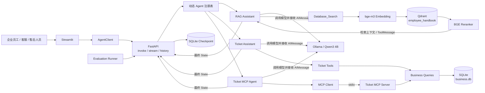

# 企业知识库与智能工单 Agent

**Enterprise Knowledge & Ticket Intelligence Agent**

> 面向企业员工、客服和售后人员的本地 AI Agent，统一处理非结构化制度文档与结构化工单数据。

本仓库基于 Joshua Carroll 的开源项目
[Agent Service Toolkit](https://github.com/JoshuaC215/agent-service-toolkit)
进行二次开发，并继续遵循原项目的 MIT License。上游项目提供了
LangGraph、FastAPI、Streamlit 和动态 Agent 服务框架；本项目重点完成企业知识库、
工单业务、MCP、本地模型、容器化部署与质量评估等场景化改造。

## 项目概述

企业内部数据通常分为两类，本项目分别使用适合的数据链路进行处理：

- 员工手册、制度文档属于非结构化长文本，通过本地 Embedding、Qdrant 和
  Cross-Encoder Reranker 完成 RAG 检索，再由 Qwen 生成回答。
- 客户、设备、工单和维修记录属于结构化业务数据，通过 SQLite 精确查询，并由
  LangGraph Agent 使用 Tool Calling 或 MCP 调用业务工具。

项目支持 FastAPI 流式与非流式接口、Streamlit 对话界面、基于 Checkpoint 的短期
对话记忆、Docker Compose 部署，以及覆盖工具选择、检索内容、最终答案与延迟的真实
Agent Evaluation。

## 我的主要改造

- 将原有 Chroma + OpenAI Embedding 链路替换为 Qdrant + 本地 `bge-m3`。
- 增加 BGE Cross-Encoder Reranker，对 Qdrant 候选 Chunk 进行精排。
- 设计客户、设备、工单、维修记录的 SQLite 业务数据层及测试数据。
- 开发 Ticket Tools、Ticket LangGraph Agent，以及基于 stdio 的 Ticket MCP Server。
- 将 Ticket Agent 注册到通用 FastAPI 路由，并接入 Streamlit Agent 选择与历史对话。
- 使用 Docker Compose 编排 Service、Streamlit、数据挂载和 Checkpoint 持久化。
- 建立规则驱动的真实 Agent Evaluation，最终基线为 5/5 Case 通过。

## 快速开始

以下命令以 Windows PowerShell 为例。首次运行需要安装：

- Python 3.12；
- [uv](https://docs.astral.sh/uv/)；
- [Ollama](https://ollama.com/)；
- Docker Desktop 与 Docker Compose。

### 1. 准备本地模型

确保 Ollama 正在运行，然后安装聊天模型和向量模型：

```powershell
ollama pull qwen3:4b
ollama pull bge-m3
ollama list
```

`qwen3:4b` 负责工具选择、推理与回答；`bge-m3` 负责将文档 Chunk 和用户问题转换为向量。

### 2. 安装项目依赖

```powershell
Copy-Item .env.example .env
uv sync --frozen
```

至少在 `.env` 中设置：

```env
USE_FAKE_MODEL=false
DEFAULT_MODEL=ollama
OLLAMA_MODEL=qwen3:4b

HOST=0.0.0.0
PORT=8080

DATABASE_TYPE=sqlite
SQLITE_DB_PATH=checkpoints.db
MODE=
```

本地开发不强制配置外部 LLM API Key。`AUTH_SECRET` 留空只适合本地开发；生产环境必须配置认证。

### 3. 初始化业务数据库和向量库

仓库已经包含示例员工手册 `data/AcmeTech_Employee_Handbook.pdf`。首次运行时执行：

```powershell
uv run python scripts/create_business_db.py
uv run python scripts/seed_business_db.py
uv run python scripts/create_qdrant_db.py
```

脚本会创建：

- `data/business.db`：客户、设备、工单和维修记录；
- `qdrant_data/`：员工手册 Chunk 的本地向量数据；
- `employee_handbook`：Qdrant 中保存员工手册向量的 Collection。

建库脚本会拒绝覆盖已有数据库或 Collection，避免重复写入和误删数据。

### 4. 使用 Docker Compose 启动

```powershell
docker compose up -d --build
docker compose ps
```

Compose 中的 Agent Service 使用 `host.docker.internal:11434` 访问 Windows 宿主机上的 Ollama。

启动完成后访问：

- FastAPI 健康检查：<http://localhost:8080/health>
- FastAPI 服务信息：<http://localhost:8080/info>
- Streamlit：<http://localhost:8501>

停止容器：

```powershell
docker compose down
```

`docker compose down` 默认保留 Checkpoint Named Volume；执行 `docker compose down --volumes` 会同时删除持久化的对话状态。

### 5. 不使用 Docker 启动

先在一个 PowerShell 窗口启动服务端：

```powershell
uv run python src/run_service.py
```

再在另一个 PowerShell 窗口启动 Streamlit：

```powershell
uv run streamlit run src/streamlit_app.py
```

## 系统架构



两条核心数据链路分别是：

```text
RAG：用户问题 → 第一次 Qwen → Database_Search → bge-m3 → Qdrant Top-K → Reranker Top-N → ToolMessage → 第二次 Qwen
工单：用户问题 → 第一次 Qwen → Tool Calling → 本地 Tool 或 MCP → SQLite → ToolMessage → 第二次 Qwen
```

`checkpoints.db` 保存 LangGraph 对话 State；`business.db` 保存客户、设备、工单和维修记录，二者职责分离。

## 核心能力

1. **企业 RAG 检索**：加载并切分 PDF、DOCX 文档，使用本地 `bge-m3` 完成向量化，通过 Qdrant Top-K 召回候选 Chunk，再使用 BGE Cross-Encoder Reranker 精排，最终由 Qwen 基于检索上下文回答。
2. **LangGraph Tool Calling + MCP**：针对客户、设备、工单和维修记录等结构化数据，由 LangGraph 根据 `AIMessage.tool_calls` 路由本地 Tool 或 MCP Tool，通过 SQLite 获得准确数据，再将 `ToolMessage` 交给模型生成最终答案；MCP 版本支持通过 stdio 跨进程发现和调用工具。
3. **Docker 部署 + Evaluation**：使用 Docker Compose 编排 FastAPI Agent Service 和 Streamlit，处理宿主机 Ollama 访问、业务数据挂载与 Checkpoint 持久化；真实 Evaluation 分层检查工具选择、参数、工具结果、最终答案和端到端延迟。

项目还提供动态 Agent 注册、invoke/stream/history/threads 接口、SSE 流式响应、Streamlit Agent 选择，以及按 `thread_id` 隔离的短期对话记忆。

## 核心目录

| 路径 | 职责 |
| --- | --- |
| `src/agents/` | LangGraph Agent、Ticket Tools 和 MCP Agent |
| `src/business/` | SQLite 业务查询与数据访问层 |
| `src/mcp_servers/` | 基于 stdio 的 Ticket MCP Server |
| `src/core/` | 模型创建、运行配置和全局 Settings |
| `src/service/` | FastAPI 路由、Agent 调用与 SSE 响应编排 |
| `src/client/` | invoke、stream、history 等服务客户端 |
| `scripts/` | 业务建库、种子数据、查询验证和 Qdrant 建库脚本 |
| `evals/` | 真实 Agent Case、事件收集、规则评分与报告生成 |
| `tests/` | 单元测试、协议集成测试和真实 Graph 服务测试 |
| `compose.yaml` | Service、Streamlit、数据挂载和持久化编排 |

## API 调用示例

服务启动后，可以直接通过动态 Agent 路由调用 Ticket MCP Agent：

```powershell
$body = @{
    message = "Use the get_customer_tickets tool for customer ID 1. List every ticket ID and status."
    thread_id = "readme-ticket-demo"
    user_id = "readme-demo-user"
} | ConvertTo-Json

$response = Invoke-RestMethod `
    -Method Post `
    -Uri "http://localhost:8080/ticket-mcp-agent/invoke" `
    -ContentType "application/json" `
    -Body $body

$response.content
```

复用相同 `thread_id` 可以继续同一段对话；使用新的 `thread_id` 会创建相互隔离的 Graph State。

## 测试与质量评估

运行自动化测试：

```powershell
uv run pytest
```

自动化测试主要使用 Fake Model、Mock 和临时数据库验证确定性代码，不要求真实 Qwen 每次生成完全相同的文本。

在 Ollama、Agent Service、业务数据库和 Qdrant 均可用时，运行真实 Agent Evaluation：

```powershell
uv run python evals/run_evaluation.py --timeout-seconds 600
```

Evaluation 会分别记录：

- 工具是否选择正确；
- 工具参数是否正确；
- 工具结果是否包含预期事实；
- 最终答案是否包含关键事实；
- 每条 Case 的端到端延迟。

当前本地基线为 5/5 Case 通过。该结果仅表示当前样例在本次运行环境中通过，不代表所有问题都能正确回答。

更完整的学习、实现和 Debug 记录见 [`PROJECT_NOTES.md`](PROJECT_NOTES.md)。

## 开源来源与许可证

本项目基于 [JoshuaC215/agent-service-toolkit](https://github.com/JoshuaC215/agent-service-toolkit) 进行二次开发。

原项目与本项目均遵循 [MIT License](LICENSE)。仓库保留原作者的版权和许可证声明；本 README 中的“我的主要改造”专门说明了本项目在原有框架基础上新增或重构的内容。
